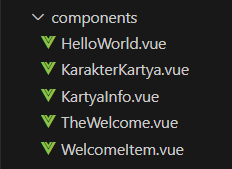
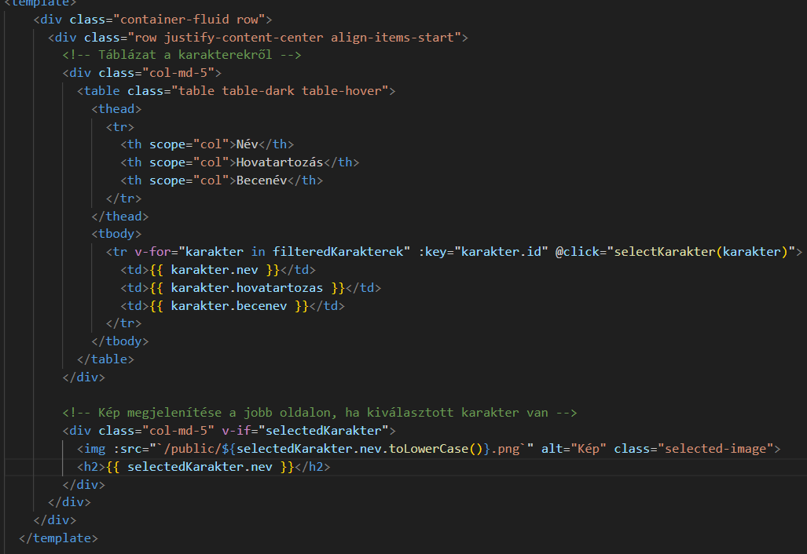
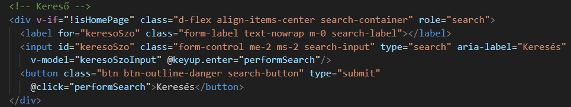
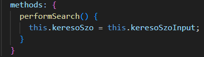

# Kártya Projekt

## Általános leírás

> Ez a projekt egy kártya alapú alkalmazás, amely főként karakterek vizualizálását, keresését, szűrését, valamint adatainak táblázatos megjelenítését szolgálja. A rendszer a frontend és backend technológiák harmonikus együttműködésére épül.

## Milyen technológiát használunk

> - Backend: N/A
> - Frontend: A frontend Vue.js alapon működik, amely egy dinamikus és hatékony komponens alapú keretrendszer.
> - Dizájn: A frontend UI tervezése Bootstrap és Tailwind CSS alapú. Stíluselemek, mint hover effekt, dinamizmus és megjelenés erőteljesen testreszabott CSS-eken alapulnak.
> - Adatbázis: A táblázatban tárolt karakterek adatai lekérdezhetőek és megjeleníthetőek.

# Menüpontok, funkciók

## Home

> Az alkalmazás kezdőoldala, ahol rövid bemutatás található.

## Táblázat

> A karakterek adatainak táblázatos formában történő megjelenítése, például név, hovatartozás, becenév. Keresés és szűrés is biztosított.

## Kártyák

> A kártyák vizualizálják a karakterek részletes információit, mint kép, név, leírás.

## Keresés

> A felhasználó kereshet a karakterek nevében vagy leírásában.

## Szűrés

> Szűrés biztosított több paraméter alapján (pl. név, hovatartozás).

# Adatforrás

> - Tábla funkciója: A táblázatban a karakterek alapvető adatai jelennek meg.
> - Oszlopok: név, hovatartozás, becenév
> - Adat elhelyezkedése: A karakterek adatai lehetnek fájlokban vagy adatbázisban tárolva.

> - Egy kódrészlet a tábláról:

>  
```
 karakterek: [
                { id: 1, nev: "Alucard", hovatartozas: "Hellsing Organization", becenev: "Dracula" },
                { id: 2, nev: "Anderson", hovatartozas: "Iscariot", becenev: "Paladin" },
                { id: 3, nev: "Captain", hovatartozas: "Millennium", becenev: "The Wolfman" },
                { id: 4, nev: "Dornez", hovatartozas: "Hellsing Organization", becenev: "Angel of Death" },
                { id: 5, nev: "Major", hovatartozas: "Millennium", becenev: "Sturmbannführer" },
                { id: 7, nev: "Schrodinger", hovatartozas: "Millennium", becenev: "The Catboy" },
                { id: 8, nev: "Victoria", hovatartozas: "Hellsing Organization", becenev: "Draculina" },
                { id: 9, nev: "Wingates", hovatartozas: "Hellsing Organization", becenev: "Sir Integra" }
            ],
            selectedKarakter: null,
        };
``` 

# A program részletezése

## könyvtár és állomány szerkezet, modulok



> - Könyvtár és állomány szerkezet: A projekt Vue.js komponensekkel van felépítve, a components mappában találhatóak az egyes funkcionális egységek (pl. Kártya és Táblázat).

## Home megvalósítása

> A home oldal fő eleme egy középre igazított kép.

> - Stílus: Az img-container stílus gondoskodik arról, hogy a kép középen jelenjen meg. 

> - Dizájn: A kép igazítása és a stílus megvalósítása itt alapvető vizuális elemekre koncentrál, amelyek a Home oldalt alkotják. 

# Táblázat megvalósítása


### Miért kell a táblázat

> A táblázat a különböző adatokat jeleníti meg, és segíti a felhasználókat azok rendszerezésében és áttekintésében (pl. karakterek, tulajdonságok, vagy projektek adatai).

### Mely fájlok, a komponensek

> - KarakterKartya.vue
> - KartyaInfo.vue

### Szerkezet

> A táblázat szerkezetét a v-for direktíva segítségével hozhatjuk létre, ami ciklikusan végigmegy az adatokon.

### Vizualizálás módja, dizájn,



> Bootstrap és CSS framework segítségével formáztam a táblázatot.

### Sorbarakás

> A táblázat adatait JavaScript-függvényekkel lehet rendezni, pl. egy oszlop fejlécére kattintva.

### Egyéb funkciók

> Keresés és szűrés integrálása a táblázathoz.

## Kártyák

> A kártyákat hasonlóan a táblázathoz egy új komponensben valósítottam meg. Ez a karakterkártyák listája, amely minden egyes elem esetén egy kártyát jelenít meg.

## Keresés

> ### Hogy kell keresni:
> - A keresési mechanizmus egy egyszerű bemeneti mezővel (input field) valósítható meg, ami a keresőszó alapján szűri az adatokat.

### A keresés mechanizmusa




> - A kód keresoSzoInput változó segítségével valósítja meg a keresést. A v-model köti össze az input mezőt a keresési szöveggel, a performSearch() függvény pedig a szűrést végzi.

### Szűrés

> - N/A


